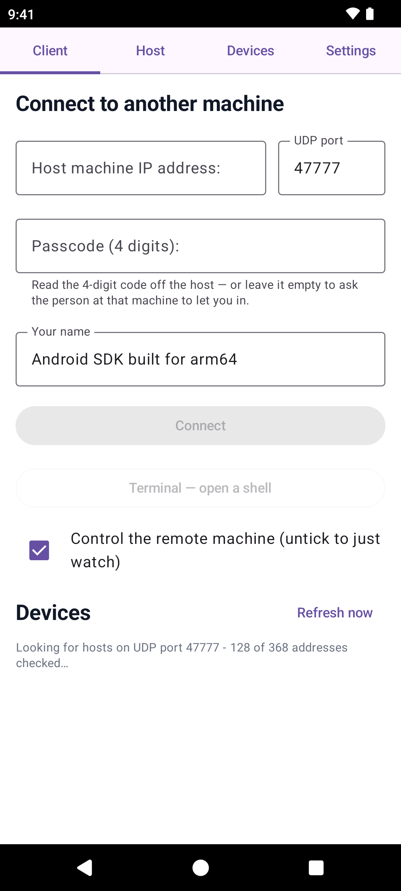
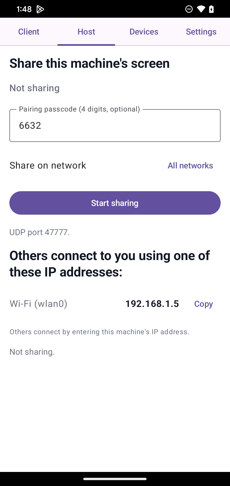

**English** · [Tiếng Việt](README.vi.md)

<div align="center">

# 🖥️ Deskhub

### Your machine, on every screen you own.

**Open-source. Native. Cross-platform. Remote desktop that feels local — fast and raw
enough to actually play games remotely, which ordinary remote desktop tools can't pull off.**

[](https://github.com/manhpham90vn/Deskhub/releases)
[](LICENSE)
[](CMakeLists.txt)
[](#-platforms)

[](https://github.com/manhpham90vn/Deskhub/actions/workflows/build.yml)
[](https://github.com/manhpham90vn/Deskhub/actions/workflows/build.yml)
[](https://github.com/manhpham90vn/Deskhub/actions/workflows/lint.yml)
[](https://github.com/manhpham90vn/Deskhub/actions/workflows/codeql.yml)
[](https://github.com/manhpham90vn/Deskhub/actions/workflows/fuzz-nightly.yml)


<sub>A macOS host mid-share — live capture/send rates and bandwidth per display, every viewer
on its own row, one-click <b>Stop</b> and <b>Disconnect</b>. Yes, that RTT says <b>0 ms</b>.</sub>

</div>

One **C++20 core** runs everywhere — Windows to iPhone — zero protocol rewrites. Share a
display, type an IP on the other machine, and you're driving it.

| ⚡ Fast | 📦 One file | 🎛️ Simple |
| ------ | ---------- | --------- |
| **~3.5 ms** capture→display, 60 fps. Zero-copy VRAM pipeline — the hot path never touches the CPU. | No installer, no background service, no account. The entire Windows app is one **~5.1 MB** exe; macOS is a **1.9 MB** dmg. | The same three sections everywhere — **Host**, **Client**, **Settings**. **Share** a display or **Connect** to an IP, and that's it. Phones host too, view-only, since no mobile OS lets an app inject input. |

## 👀 A quick look

<table>
  <tr>
    <td align="center" width="50%">
      
      <br><sub><b>Client</b> — type an IP, or just click a machine the network scan found. Recent devices come back with a live online/offline status and ping.</sub>
    </td>
    <td align="center" width="50%">
      
      <br><sub><b>Settings</b> — fps, bitrate, quality cap, port, the mandatory 4-digit passcode, the view-only switch, and (on macOS) the live permission state.</sub>
    </td>
  </tr>
</table>

<p align="center">
  
  &nbsp;&nbsp;
  
</p>
<p align="center"><sub>The same app on an iPhone — scan the network, tap a machine, enter the 4-digit code… or flip to the Host tab and share the phone's own screen.</sub></p>

<p align="center">
  
  &nbsp;&nbsp;
  
</p>
<p align="center"><sub>And on Android — the same Client and Host pages; hosting is a view-only screen share on Android 10+.</sub></p>

## 💡 Why

- 💻 **Work** — run Claude Code, VS Code, or builds on your home PC from a weak laptop or an iPad at a café.
- 🌐 **Anything** — drive Chrome, Office, or PC-only software from any device.
- 🎮 **Games** — 60 fps, relative mouse + DirectInput scancodes, `F9` pointer lock.
- 🖥️ **Multi-monitor** — share one or several displays, each as its own session.

## 🚦 Platforms

| Platform | Host | Client | Status |
| -------- | :--: | :----: | ------ |
| **Windows** | ✅ | ✅ | Reference implementation — daily use over LAN + Tailscale (Internet/NAT) |
| **macOS** | ✅ | ✅ | Both roles working (ScreenCaptureKit + VideoToolbox + CGEvent) |
| **Android** | ✅ | ✅ | Client: video + input (trackpad, keyboard). Host: view-only screen share (MediaProjection + MediaCodec), Android 10+ — testing on Google Play |
| **iOS** | ✅ | ✅ | Client: video + input (trackpad, keyboard). Host: view-only screen share via a Broadcast Upload Extension (ReplayKit + VideoToolbox) — testing via TestFlight |
| **Linux** | ✅ | ✅ | Both roles working (PipeWire + VA-API + uinput + GTK3) — Ubuntu, Debian, Mint, Fedora, openSUSE, Arch via deb / rpm / portable binary; verified between two machines over LAN |

## 🔒 Before you share a screen

> **⚠️ Deskhub encrypts nothing. Every host requires a 4-digit passcode — generated for
> you on first launch — but that code travels in the clear like everything else, so
> anyone who can capture a single packet on your network reads it and gets full mouse and
> keyboard control of the sharing machine.**
>
> Run it on a **network you trust**, or over a **VPN** — install
> [Tailscale](https://tailscale.com) on both machines and connect to the `100.x.y.z`
> address. **Never port-forward UDP 47777**, and don't share your screen on café,
> hotel, office or any other shared Wi-Fi.

That is the whole security model: Deskhub borrows its encryption and its identity check
from the layer underneath it. Read [`SECURITY.md`](SECURITY.md) for the full threat
model, what is and isn't protected, and how to report a vulnerability.

## 🚀 Get it

**🪟 Windows & 🍎 macOS** — grab a single `.exe` / `.dmg` from
**[Releases](https://github.com/manhpham90vn/Deskhub/releases)** — no install, no setup.
On Windows the app asks for administrator once as it starts — it needs that to inject
input into elevated windows — and adds its own Windows Firewall rule when you share.

**🐧 Linux** — pick the file matching your distro from
[Releases](https://github.com/manhpham90vn/Deskhub/releases); the deb and the rpm carry
identical content:

| Distro | File | Install |
| --- | --- | --- |
| Ubuntu, Kubuntu, Debian, Mint | `deskhub-v*-amd64.deb` | `sudo apt install ./deskhub-v*-amd64.deb` |
| Fedora (Workstation & KDE spin) | `deskhub-v*-x86_64.rpm` | `sudo dnf install ./deskhub-v*-x86_64.rpm` |
| openSUSE | `deskhub-v*-x86_64.rpm` | `sudo zypper install ./deskhub-v*-x86_64.rpm` |
| Arch, anything else | `deskhub-v*-linux-x86_64` | `chmod +x deskhub-v*-linux-x86_64 && ./deskhub-v*-linux-x86_64` |

Both packages ship the `/dev/uinput` udev rule (requirement 3 below), so remote input
works right after install — no group change, no re-login. The portable binary runs on any
x86_64 distro with glibc 2.35+ (Ubuntu 22.04, Fedora 36, openSUSE 15.5, any current
Arch); it links only against GTK3, PipeWire and libva, which every stock desktop already
has, and the H.264 decoder is compiled in.

**To connect and view, installing is all it takes.** To **share this machine's screen**,
three more things must be in place:

**1. A screen-capture portal.** Deskhub always captures through `xdg-desktop-portal` — it
is what shows the "which screen to share?" dialog. GNOME and KDE ship their portal
backend out of the box on every major distro — **nothing to do** on Ubuntu, Kubuntu,
Fedora Workstation, Fedora KDE, openSUSE or Arch with GNOME/KDE. Standalone window
managers do need one:

```bash
sudo apt install xdg-desktop-portal-wlr      # sway / river / Wayfire on Debian-family
sudo dnf install xdg-desktop-portal-wlr      # …on Fedora
sudo pacman -S xdg-desktop-portal-wlr        # …on Arch
```

sway, river and Wayfire are Wayland compositors built on the **wlroots** library; unlike
GNOME/KDE they ship no portal backend of their own, and `-wlr` is the backend that
implements screen capture for all of them (Hyprland has its own
`xdg-desktop-portal-hyprland`).

**2. A VA-API driver.** H.264 is encoded on the GPU; there is no software fallback:

```bash
# Ubuntu / Debian / Mint
sudo apt install va-driver-all vainfo        # NVIDIA also needs: nvidia-vaapi-driver

# Fedora — stock Mesa has H.264 disabled; the working drivers live in RPM Fusion:
sudo dnf install libva-utils
sudo dnf install mesa-va-drivers-freeworld   # AMD (RPM Fusion)
sudo dnf install intel-media-driver          # Intel (RPM Fusion)
sudo dnf install nvidia-vaapi-driver         # NVIDIA (RPM Fusion)

# openSUSE
sudo zypper install libva-utils              # plus your GPU vendor's VA-API driver

# Arch
sudo pacman -S libva-utils
sudo pacman -S libva-mesa-driver             # AMD · Intel: intel-media-driver · NVIDIA: libva-nvidia-driver

# then on every distro:
vainfo | grep -E 'H264.*Enc'                 # must print ≥1 line, or this machine cannot host
```

**3. Write access to `/dev/uinput`** — how mouse and keyboard get injected. This is a
udev rule the deb/rpm installs for you. On the portable binary, one command sets it up
(no clone, no re-login on the desktop):

```bash
curl -fsSL https://raw.githubusercontent.com/manhpham90vn/Deskhub/main/scripts/setup-uinput.sh | sudo bash
```

Prefer reading before piping to sudo? Download
[`scripts/setup-uinput.sh`](scripts/setup-uinput.sh) first — it is a dozen lines. From a
source checkout the same thing is `make setup-linux-permissions`.

If you enabled a firewall, also open UDP 47777 (`sudo ufw allow 47777/udp` /
`sudo firewall-cmd --add-port=47777/udp --permanent`). Without the uinput grant the app
still runs and can still view — it just cannot inject mouse/keyboard into this machine.

**📱 iOS** — install [TestFlight](https://apps.apple.com/app/testflight/id899247664), then
join the beta: **[testflight.apple.com/join/7qY7wgpd](https://testflight.apple.com/join/7qY7wgpd)**

**🤖 Android** — direct APK from [Releases](https://github.com/manhpham90vn/Deskhub/releases),
or join the Play beta — three steps, **same Google account** as your phone's Play Store:

1. Join the tester group: [groups.google.com/g/deskhub-test](https://groups.google.com/g/deskhub-test)
2. Become a tester: [play.google.com/apps/testing/com.manhpham.deskhub](https://play.google.com/apps/testing/com.manhpham.deskhub)
3. Install (give Play a few minutes to sync): [play.google.com/store/apps/details?id=com.manhpham.deskhub](https://play.google.com/store/apps/details?id=com.manhpham.deskhub)
   — then please keep it installed **14+ days** (Google's requirement to go public).

## 🕹️ Using it

On desktop, **Host** picks the display(s) to expose, and its *Share on network* choice
pins the host to one of the machine's addresses so it is unreachable from every other
network it happens to be on — the address list beneath it shows only the chosen network,
and if that address disappears, sharing falls back to all networks and says so in the
status line. **Client** takes the
other machine's IP (UDP 47777 unless you change the port). Up to **5 viewers** can watch
one host at a time, and machines you have connected to before come back under **Recent
devices** with a live online/offline dot. The **Your name** field on the Client page
names this device — it defaults to the device's own name and can be edited — so a host
with several viewers can tell them apart.

Only one viewer drives the mouse and keyboard at a time: the earliest to have joined
wins ties, and the others' input is dropped until it has been idle for a second. The
person sitting at the host outranks all of them. **Settings** on every desktop host holds
two access controls: the **4-digit passcode** viewers must enter — generated on first
launch, changeable at any time, and not something you can turn off, with three wrong
tries locking the host for 30 seconds — and *Viewers can control this machine*, which you
can untick to share **view-only** (the host drops every input packet it receives). All
five clients can enter a passcode and remember it per device. The passcode is not
encryption — see [`SECURITY.md`](SECURITY.md).

**Settings** also holds the desktop quality-of-life toggles. *Start Deskhub when you
log in* registers the platform's own
launch-at-login mechanism — an autostart entry on Linux, a scheduled task on Windows (so
no UAC prompt at logon), a Login Item on macOS — and *Start sharing when Deskhub opens*
presses Share for you on launch. *Keep running in the background* adds a tray / menu-bar
icon with Show/Hide, Start/Stop sharing and Quit, and turns the window's close button
into "hide" — the window still opens visible on every launch: combine the three and the
machine starts sharing at login on its own, hiding into the tray once you close the
window.
*Sync clipboard text* makes plain text copied on one machine pastable on the others
(both directions, text only, 32 KiB cap) — it rides the same unencrypted channel as the
video, so leave it off on networks you do not trust.

Over the Internet: run [Tailscale](https://tailscale.com) on both machines and use the
100.x.y.z IP — never a port-forward. On mobile the video frame is a trackpad:
drag = move, tap = click, hold-drag = drag, **Keys** = virtual keyboard.

Build from source: `make bootstrap` then `make build-<os>` — every target is documented
at the top of the [`Makefile`](Makefile). Bugs & feedback:
[issues](https://github.com/manhpham90vn/Deskhub/issues) — include your device model.

## 📚 Docs

Every document below is published in English, with a Vietnamese translation beside it as
`*.vi.md`. The English text is the authoritative one.

- [Functional specification](docs/SPECIFICATION.md) — what Deskhub does, with no implementation detail ([Tiếng Việt](docs/SPECIFICATION.vi.md))
- [`SECURITY.md`](SECURITY.md) — threat model and how to report a vulnerability ([Tiếng Việt](SECURITY.vi.md))
- [`PRIVACY.md`](PRIVACY.md) — privacy policy ([Tiếng Việt](PRIVACY.vi.md))
- [`THIRD_PARTY_NOTICES.md`](THIRD_PARTY_NOTICES.md) — third-party components ([Tiếng Việt](THIRD_PARTY_NOTICES.vi.md))

## ✨ Under the hood

- **Zero-copy end to end** — capture straight into VRAM → NVENC → HW decode → render; the hot path never touches the CPU.
- **Purpose-built UDP protocol** — infinite GOP + on-demand IDR, XOR FEC, adaptive bitrate.
- **Real input** — relative mouse (Raw Input) + scancodes for DirectInput games; host's own mouse/keyboard always wins.
- **One shared core** — protocol, FEC, and bitrate control live in `core/`, compiled into every client.
- **Beaten up on purpose** — the core is unit-tested offline, runs under ASan, UBSan and TSan in CI, and six libFuzzer targets hammer the wire format, H.264 parsing, reassembly and session state machines every night; every crash found becomes a regression test.

## 📄 License

MIT — see [`LICENSE`](LICENSE). Third-party components and their notices (including the
statically linked LGPL build of FFmpeg in the Linux app) are listed in
[`THIRD_PARTY_NOTICES.md`](THIRD_PARTY_NOTICES.md).
