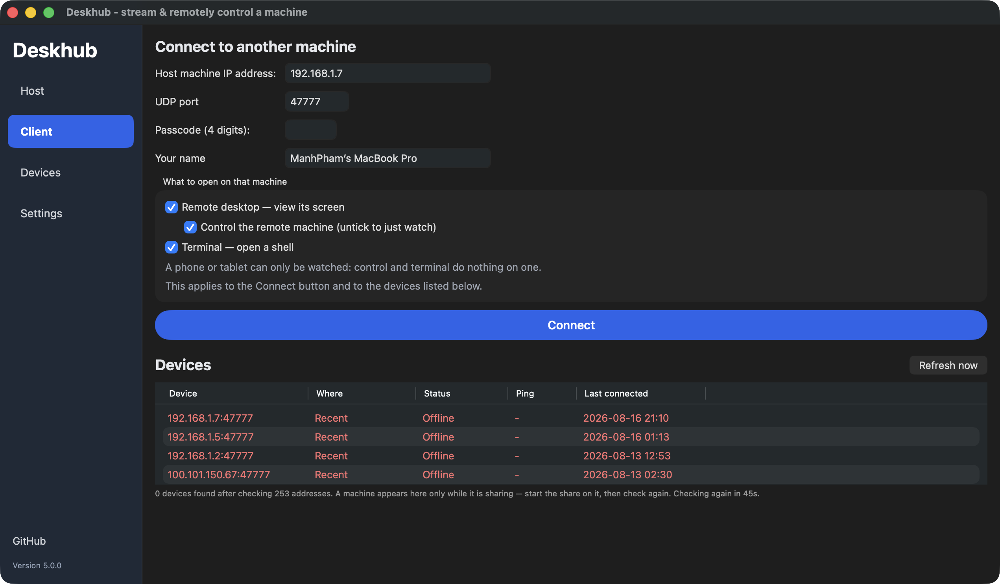
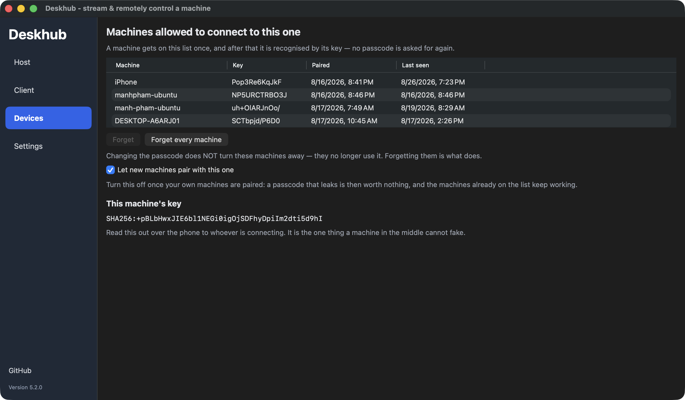
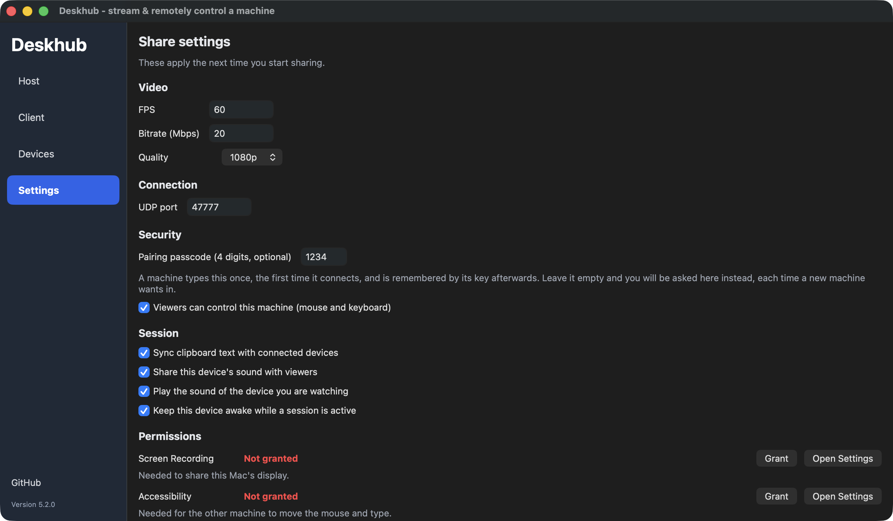
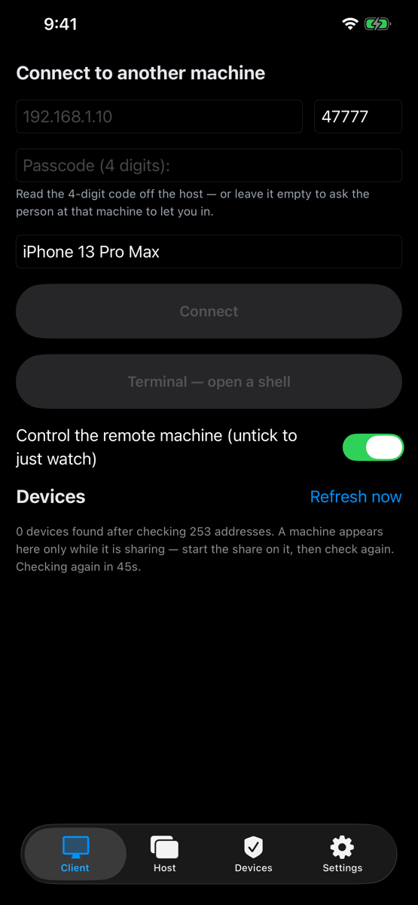
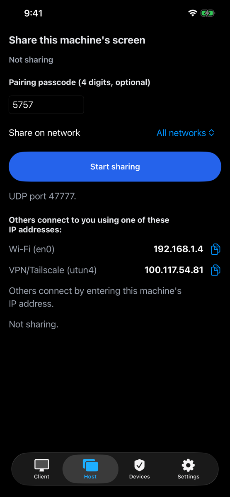

[English](README.md) · **Tiếng Việt**

<div align="center">

# 🖥️ Deskhub

### Máy của bạn, trên mọi màn hình bạn có.

**Mã nguồn mở. Native. Đa nền tảng. Remote desktop mượt như ngồi tại máy — nhanh và thô
đủ để chơi game từ xa thật sự, điều mà các công cụ remote desktop thông thường không làm nổi.**

[](https://github.com/manhpham90vn/Deskhub/releases)
[](LICENSE)
[](CMakeLists.txt)
[](#-nền-tảng)

[](https://github.com/manhpham90vn/Deskhub/actions/workflows/build.yml)
[](https://github.com/manhpham90vn/Deskhub/actions/workflows/tests.yml)
[](https://github.com/manhpham90vn/Deskhub/actions/workflows/lint.yml)
[](https://github.com/manhpham90vn/Deskhub/actions/workflows/codeql.yml)
[](https://github.com/manhpham90vn/Deskhub/actions/workflows/fuzz-nightly.yml)



<sub>Một host macOS đang chia sẻ — tốc độ thu/gửi và băng thông theo thời gian thực cho từng
màn hình, mỗi người xem một dòng riêng, <b>Stop</b> và <b>Disconnect</b> chỉ một cú bấm.
Đúng vậy, RTT ghi <b>0 ms</b>.</sub>

</div>

Một **lõi C++20** duy nhất chạy trên mọi nền tảng — từ Windows tới iPhone — không phải
viết lại giao thức lần nào. Chia sẻ một màn hình, gõ IP ở máy kia, và bạn đang điều khiển
nó.

| ⚡ Nhanh | 📦 Một file | 🎛️ Đơn giản |
| ------ | ---------- | --------- |
| **~3.5 ms** từ lúc thu hình tới lúc hiện hình, 60 fps. Đường dữ liệu đi thẳng trong VRAM — không đụng tới CPU. | Không cài đặt, không dịch vụ chạy nền, không tài khoản. Toàn bộ app Windows là một file exe **~5.1 MB**; macOS là file dmg **1.9 MB**. | Cùng ba mục trên mọi máy tính — **Host**, **Client**, **Settings**; điện thoại và máy tính bảng bỏ **Host** vì chỉ xem được. **Share** một màn hình hoặc **Connect** tới một IP, hết. |

## 👀 Nhìn qua một chút

<table>
  <tr>
    <td align="center" width="50%">
      
      <br><sub><b>Client</b> — gõ một IP, hoặc chỉ cần bấm vào máy mà trình quét mạng tìm thấy. Các thiết bị từng kết nối quay lại kèm trạng thái online/offline và ping theo thời gian thực.</sub>
    </td>
    <td align="center" width="50%">
      
      <br><sub><b>Settings</b> — fps, bitrate, mức chất lượng, cổng, mã 4 chữ số bắt buộc, công tắc chỉ-xem, và (trên macOS) trạng thái cấp quyền theo thời gian thực.</sub>
    </td>
  </tr>
</table>

<p align="center">
  
  &nbsp;&nbsp;
  
</p>
<p align="center"><sub>Vẫn app đó trên iPhone — quét mạng, chạm vào một máy, nhập mã 4 chữ số, và desktop của bạn chỉ cách một cái trackpad.</sub></p>

## 💡 Để làm gì

- 💻 **Làm việc** — chạy Claude Code, VS Code hay build project trên PC ở nhà từ một chiếc laptop yếu hoặc iPad ngoài quán cà phê.
- 🌐 **Mọi thứ** — điều khiển Chrome, Office hay phần mềm chỉ có trên PC từ bất kỳ thiết bị nào.
- 🎮 **Game** — 60 fps, chuột tương đối + scancode DirectInput, khoá con trỏ bằng `F9`.
- 🖥️ **Nhiều màn hình** — chia sẻ một hoặc nhiều màn hình, mỗi màn hình là một phiên riêng.

## 🚦 Nền tảng

| Nền tảng | Host | Client | Trạng thái |
| -------- | :--: | :----: | ------ |
| **Windows** | ✅ | ✅ | Bản tham chiếu — dùng hằng ngày qua LAN + Tailscale (Internet/NAT) |
| **macOS** | ✅ | ✅ | Cả hai vai trò đã chạy (ScreenCaptureKit + VideoToolbox + CGEvent) |
| **Android** | — | ✅ | Video + điều khiển (trackpad, bàn phím) — đang thử nghiệm trên Google Play |
| **iOS** | — | ✅ | Video + điều khiển (trackpad, bàn phím) — đang thử nghiệm qua TestFlight |
| **Linux** | ✅ | ✅ | Cả hai vai trò đã chạy (PipeWire + VA-API + uinput + GTK3) — Ubuntu, Debian, Mint, Fedora, openSUSE, Arch qua deb / rpm / binary chạy thẳng; đã kiểm chứng giữa hai máy qua LAN |

## 🔒 Đọc trước khi chia sẻ màn hình

> **⚠️ Deskhub không mã hoá bất cứ thứ gì. Mọi host đều yêu cầu mã 4 chữ số — được sinh
> tự động cho bạn ở lần chạy đầu tiên — nhưng mã đó cũng đi ở dạng thô như mọi thứ khác,
> nên bất kỳ ai bắt được một gói tin trong mạng của bạn đều đọc ra được nó và có toàn
> quyền chuột và bàn phím trên máy đang chia sẻ.**
>
> Hãy dùng trong **mạng bạn tin tưởng**, hoặc qua **VPN** — cài
> [Tailscale](https://tailscale.com) trên cả hai máy rồi kết nối tới địa chỉ `100.x.y.z`.
> **Đừng bao giờ mở port-forward cho UDP 47777**, và đừng chia sẻ màn hình trên Wi-Fi
> quán cà phê, khách sạn, văn phòng hay bất kỳ mạng dùng chung nào.

Đó là toàn bộ mô hình bảo mật: Deskhub mượn phần mã hoá và phần xác thực danh tính từ
tầng bên dưới nó. Đọc [`SECURITY.vi.md`](SECURITY.vi.md) để biết đầy đủ mô hình mối đe doạ,
những gì được và không được bảo vệ, và cách báo lỗ hổng.

## 🚀 Tải về

**🪟 Windows & 🍎 macOS** — tải một file `.exe` / `.dmg` duy nhất tại
**[Releases](https://github.com/manhpham90vn/Deskhub/releases)** — không cài, không cấu
hình. Trên Windows, app xin quyền quản trị một lần lúc khởi động — cần quyền này để gõ
được vào các cửa sổ chạy với quyền cao — và tự thêm luật Windows Firewall khi bạn bắt
đầu chia sẻ.

**🐧 Linux** — chọn file hợp với bản phân phối của bạn tại
[Releases](https://github.com/manhpham90vn/Deskhub/releases); deb và rpm có nội dung
giống hệt nhau:

| Bản phân phối | File | Cài đặt |
| --- | --- | --- |
| Ubuntu, Kubuntu, Debian, Mint | `deskhub-v*-amd64.deb` | `sudo apt install ./deskhub-v*-amd64.deb` |
| Fedora (Workstation & bản KDE) | `deskhub-v*-x86_64.rpm` | `sudo dnf install ./deskhub-v*-x86_64.rpm` |
| openSUSE | `deskhub-v*-x86_64.rpm` | `sudo zypper install ./deskhub-v*-x86_64.rpm` |
| Arch, các bản khác | `deskhub-v*-linux-x86_64` | `chmod +x deskhub-v*-linux-x86_64 && ./deskhub-v*-linux-x86_64` |

Cả hai gói đều kèm sẵn udev rule cho `/dev/uinput` (yêu cầu số 3 bên dưới), nên điều
khiển từ xa chạy ngay sau khi cài — không cần đổi group, không cần đăng nhập lại. Bản
binary chạy thẳng hoạt động trên mọi bản phân phối x86_64 có glibc 2.35+ (Ubuntu 22.04,
Fedora 36, openSUSE 15.5, Arch hiện hành); nó chỉ liên kết tới GTK3, PipeWire và libva —
những thứ mọi desktop mặc định đều có — còn bộ giải mã H.264 thì được biên dịch sẵn bên
trong.

**Để kết nối và xem thì chỉ cần cài là đủ.** Để **chia sẻ màn hình của máy này**, cần
thêm ba thứ:

**1. Một screen-capture portal.** Deskhub luôn thu hình qua `xdg-desktop-portal` — đây là
thứ hiện hộp thoại "chia sẻ màn hình nào?". GNOME và KDE có sẵn portal backend trên mọi
bản phân phối lớn — **không cần làm gì** trên Ubuntu, Kubuntu, Fedora Workstation, Fedora
KDE, openSUSE hay Arch dùng GNOME/KDE. Các window manager độc lập thì cần cài:

```bash
sudo apt install xdg-desktop-portal-wlr      # sway / river / Wayfire trên dòng Debian
sudo dnf install xdg-desktop-portal-wlr      # …trên Fedora
sudo pacman -S xdg-desktop-portal-wlr        # …trên Arch
```

sway, river và Wayfire là các compositor Wayland dựa trên thư viện **wlroots**; khác với
GNOME/KDE, chúng không kèm portal backend riêng, và `-wlr` là backend hiện thực phần thu
hình cho cả ba (Hyprland có backend riêng là `xdg-desktop-portal-hyprland`).

**2. Một driver VA-API.** H.264 được mã hoá trên GPU; không có phương án dự phòng bằng
phần mềm:

```bash
# Ubuntu / Debian / Mint
sudo apt install va-driver-all vainfo        # NVIDIA cần thêm: nvidia-vaapi-driver

# Fedora — Mesa mặc định đã tắt H.264; driver dùng được nằm ở RPM Fusion:
sudo dnf install libva-utils
sudo dnf install mesa-va-drivers-freeworld   # AMD (RPM Fusion)
sudo dnf install intel-media-driver          # Intel (RPM Fusion)
sudo dnf install nvidia-vaapi-driver         # NVIDIA (RPM Fusion)

# openSUSE
sudo zypper install libva-utils              # kèm driver VA-API của hãng GPU của bạn

# Arch
sudo pacman -S libva-utils
sudo pacman -S libva-mesa-driver             # AMD · Intel: intel-media-driver · NVIDIA: libva-nvidia-driver

# rồi trên mọi bản phân phối:
vainfo | grep -E 'H264.*Enc'                 # phải in ra ≥1 dòng, nếu không máy này không host được
```

**3. Quyền ghi vào `/dev/uinput`** — cách chuột và bàn phím được đưa vào máy. Đây là một
udev rule mà gói deb/rpm cài sẵn giúp bạn. Với bản binary chạy thẳng, một lệnh là xong
(không cần clone, không cần đăng nhập lại trên desktop):

```bash
curl -fsSL https://raw.githubusercontent.com/manhpham90vn/Deskhub/main/scripts/setup-uinput.sh | sudo bash
```

Muốn đọc trước khi pipe vào sudo? Tải
[`scripts/setup-uinput.sh`](scripts/setup-uinput.sh) về xem trước — nó dài chừng chục
dòng. Nếu bạn có sẵn mã nguồn thì lệnh tương đương là `make setup-linux-permissions`.

Nếu bạn có bật tường lửa, hãy mở thêm UDP 47777 (`sudo ufw allow 47777/udp` /
`sudo firewall-cmd --add-port=47777/udp --permanent`). Không cấp quyền uinput thì app vẫn
chạy và vẫn xem được — chỉ là không đưa được chuột/bàn phím vào máy này.

**📱 iOS** — cài [TestFlight](https://apps.apple.com/app/testflight/id899247664), rồi tham
gia bản beta: **[testflight.apple.com/join/7qY7wgpd](https://testflight.apple.com/join/7qY7wgpd)**

**🤖 Android** — tải APK trực tiếp tại [Releases](https://github.com/manhpham90vn/Deskhub/releases),
hoặc tham gia bản beta trên Play — ba bước, dùng **cùng tài khoản Google** với Play Store
trên máy bạn:

1. Vào nhóm tester: [groups.google.com/g/deskhub-test](https://groups.google.com/g/deskhub-test)
2. Đăng ký làm tester: [play.google.com/apps/testing/com.manhpham.deskhub](https://play.google.com/apps/testing/com.manhpham.deskhub)
3. Cài đặt (chờ Play đồng bộ vài phút): [play.google.com/store/apps/details?id=com.manhpham.deskhub](https://play.google.com/store/apps/details?id=com.manhpham.deskhub)
   — rồi vui lòng **giữ máy cài ít nhất 14 ngày** (yêu cầu của Google để lên bản công khai).

## 🕹️ Cách dùng

Trên desktop, **Host** chọn (các) màn hình để chia sẻ; **Client** nhập IP
của máy kia (cổng UDP 47777 nếu bạn không đổi). Tối đa **5 người xem** cùng lúc một host,
và những máy bạn từng kết nối sẽ quay lại ở mục **Recent devices** kèm chấm trạng thái
online/offline theo thời gian thực.

Tại một thời điểm chỉ một người xem điều khiển được chuột và bàn phím: ai vào trước thì
thắng khi tranh chấp, thao tác của những người còn lại bị bỏ qua cho tới khi người đang
điều khiển ngừng thao tác một giây. Người ngồi trực tiếp tại máy host thì trên tất cả.
Mục **Settings** trên mọi host desktop có hai tuỳ chọn kiểm soát truy cập: **mã 4 chữ số**
mà người xem phải nhập — được sinh ra ở lần chạy đầu, đổi được bất cứ lúc nào, và không
tắt đi được, sai ba lần thì host khoá 30 giây — và *Viewers can control this machine*, bỏ
tích để chia sẻ ở chế độ **chỉ xem** (host bỏ qua mọi gói điều khiển nhận được). Cả năm
client đều nhập được mã và nhớ mã theo từng thiết bị. Mã này không phải là mã hoá — xem
[`SECURITY.vi.md`](SECURITY.vi.md).

Qua Internet: chạy [Tailscale](https://tailscale.com) trên cả hai máy và dùng địa chỉ
100.x.y.z — đừng bao giờ port-forward. Trên di động, khung hình chính là trackpad: kéo =
di chuyển, chạm = bấm, giữ rồi kéo = rê, **Keys** = bàn phím ảo.

Build từ mã nguồn: `make bootstrap` rồi `make build-<os>` — mọi target đều được mô tả ở
đầu file [`Makefile`](Makefile). Báo lỗi & góp ý:
[issues](https://github.com/manhpham90vn/Deskhub/issues) — nhớ kèm tên thiết bị của bạn.

## 📚 Tài liệu

Mọi tài liệu dưới đây đều được công bố bằng tiếng Anh, kèm bản dịch tiếng Việt đặt cạnh
với đuôi `*.vi.md`. Bản tiếng Anh là bản chuẩn.

- [Đặc tả chức năng](docs/SPECIFICATION.vi.md) — Deskhub làm được gì, không kèm chi tiết kỹ thuật ([bản tiếng Anh](docs/SPECIFICATION.md))
- [Chính sách bảo mật](SECURITY.vi.md) — mô hình mối đe doạ và cách báo lỗ hổng ([bản tiếng Anh](SECURITY.md))
- [Chính sách quyền riêng tư](PRIVACY.vi.md) ([bản tiếng Anh](PRIVACY.md))
- [Thông báo về thành phần bên thứ ba](THIRD_PARTY_NOTICES.vi.md) ([bản tiếng Anh](THIRD_PARTY_NOTICES.md))

## ✨ Bên trong nó

- **Không sao chép dữ liệu suốt đường đi** — thu hình thẳng vào VRAM → NVENC → giải mã bằng phần cứng → hiển thị; đường dữ liệu nóng không đụng tới CPU.
- **Giao thức UDP viết riêng** — GOP vô hạn + IDR theo yêu cầu, FEC kiểu XOR, bitrate tự điều chỉnh.
- **Điều khiển thật** — chuột tương đối (Raw Input) + scancode cho game DirectInput; chuột/bàn phím của chính máy host luôn được ưu tiên.
- **Một lõi dùng chung** — giao thức, FEC và điều tiết bitrate nằm trong `core/`, được biên dịch vào mọi client.
- **Bị hành hạ có chủ đích** — phần lõi có unit test chạy offline, chạy dưới ASan, UBSan và TSan trong CI, và sáu fuzz target libFuzzer quần thảo định dạng gói tin, phân tích H.264, ráp gói và máy trạng thái phiên mỗi đêm; mọi crash tìm được đều trở thành regression test.

## 📄 Giấy phép

MIT — xem [`LICENSE`](LICENSE). Các thành phần bên thứ ba và thông báo giấy phép của
chúng (bao gồm bản FFmpeg LGPL được liên kết tĩnh trong app Linux) được liệt kê trong
[`THIRD_PARTY_NOTICES.md`](THIRD_PARTY_NOTICES.md).
