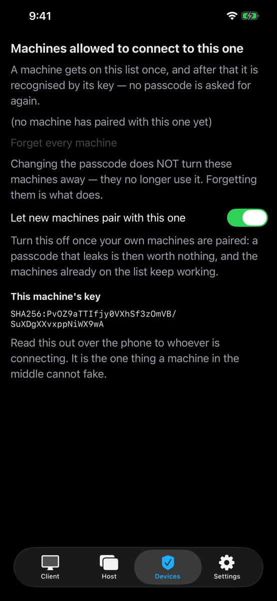
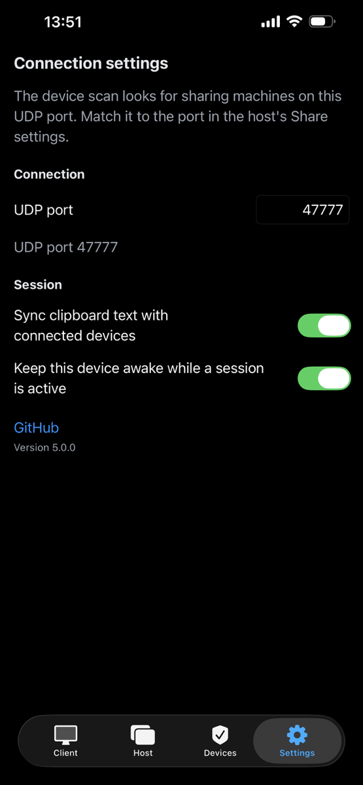
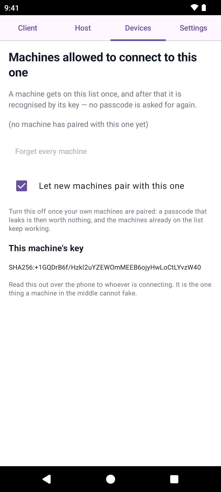
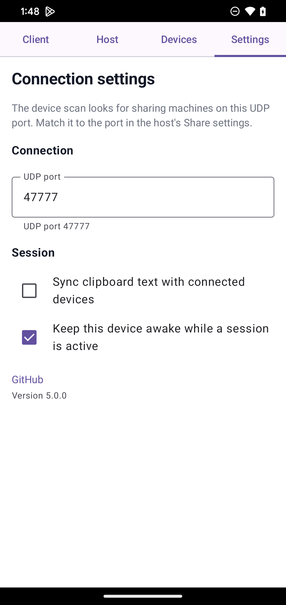

[English](README.md) · **Tiếng Việt**

<div align="center">

# 🖥️ Deskhub

### Máy của bạn, trên mọi màn hình bạn có.

**Mã nguồn mở. Native. Đa nền tảng. Remote desktop mượt như ngồi tại máy — nhanh và thô
đủ để chơi game từ xa thật sự, điều mà các công cụ remote desktop thông thường không làm nổi.**

[](https://github.com/manhpham90vn/Deskhub/releases)
[](LICENSE)
[](CMakeLists.txt)
[](#-nền-tảng)

[](https://github.com/manhpham90vn/Deskhub/actions/workflows/ci.yml)
[](https://github.com/manhpham90vn/Deskhub/actions/workflows/lint.yml)
[](https://github.com/manhpham90vn/Deskhub/actions/workflows/codeql.yml)
[](https://github.com/manhpham90vn/Deskhub/actions/workflows/nightly.yml)


<sub>Một host macOS, chỉ còn một cú tick nữa là chia sẻ. Bạn chọn cái gì được phép rời khỏi máy này —
màn hình bất kỳ, cái shell, hay cả hai — rồi bấm <b>Start sharing</b>. Khung trạng thái nói rõ có gì
đang mở ra ngoài hay không và trên cổng UDP nào, địa chỉ để đưa cho người kia nằm ngay đó kèm nút
<b>Copy</b>; còn <i>Share on network</i> ghim host vào đúng một card mạng, để nó vô hình trên mọi
mạng khác mà máy này đang nối vào.</sub>

</div>

Một **lõi C++20** duy nhất chạy trên mọi nền tảng — từ Windows tới iPhone — không phải
viết lại giao thức lần nào. Chia sẻ một màn hình, gõ IP ở máy kia, và bạn đang điều khiển
nó.

| ⚡ Nhanh | 📦 Một file | 🎛️ Đơn giản |
| ------ | ---------- | --------- |
| **~3.5 ms** từ lúc thu hình tới lúc hiện hình, 60 fps. Đường dữ liệu đi thẳng trong VRAM — không đụng tới CPU. | Không cài đặt, không dịch vụ chạy nền, không tài khoản. Toàn bộ app Windows là một file exe **~5.1 MB**; macOS là file dmg **1.9 MB**. | Cùng những trang đó trên mọi thiết bị — **Host**, **Client**, **Devices**, **Settings**. **Share** một màn hình hoặc **Connect** tới một IP, hết. Máy desktop còn chia sẻ được cả một **shell**. Điện thoại cũng chia sẻ được màn hình, nhưng chỉ xem, vì không hệ điều hành di động nào cho app bơm thao tác điều khiển. |

## 👀 Nhìn qua một chút

**Bốn trang. Năm nền tảng. Một app.** Host, Client, Devices, Settings — vẫn bốn trang đó ở
mọi nơi, nên học trên máy Mac là biết luôn app Android. Host là tấm ảnh phía trên; đây là
ba trang còn lại.

<table>
  <tr>
    <td align="center" width="33%">
      
      <br><sub><b>Client</b> — gõ một IP, hoặc bấm vào máy mà trình quét mạng tìm thấy. Bạn chọn trước sẽ mở cái gì: <i>màn hình</i>, <i>quyền điều khiển nó</i>, <i>một shell</i>, hay kết hợp tuỳ ý. Những máy bạn từng dùng quay lại trong bảng kèm trạng thái, ping và lần kết nối gần nhất.</sub>
    </td>
    <td align="center" width="33%">
      
      <br><sub><b>Devices</b> — mọi máy từng được cho vào, kèm tên và khoá, có <i>Forget</i> cho từng máy và <i>Forget every machine</i> cho tất cả. Tắt <i>Let new machines pair</i> khi máy của bạn đã nằm đủ trong danh sách, và mã có lộ ra ngoài cũng chẳng ai dùng được. Khoá của chính máy này nằm ở dưới cùng, để đọc qua điện thoại cho người kia đối chiếu.</sub>
    </td>
    <td align="center" width="33%">
      
      <br><sub><b>Settings</b> — fps, bitrate, mức chất lượng, cổng, mã 4 chữ số tuỳ chọn, cho phép người xem điều khiển máy này hay không, đồng bộ clipboard, giữ máy không ngủ, tự chạy khi đăng nhập… và trên macOS là trạng thái theo thời gian thực của hai quyền quan trọng nhất, mỗi quyền có nút <i>Grant</i> và một nút mở thẳng đúng mục trong System Settings.</sub>
    </td>
  </tr>
</table>

<p align="center">
  
  
  
  
</p>
<p align="center"><sub><b>iPhone</b> · Client — Host — Devices — Settings. Quét mạng, chạm vào một máy, rồi điều khiển nó với khung hình làm trackpad. Hoặc chuyển sang Host để chia sẻ chính màn hình điện thoại.</sub></p>

<p align="center">
  
  
  
  
</p>
<p align="center"><sub><b>Android</b> · vẫn bốn trang đó, khoác áo Material. Chia sẻ màn hình ở chế độ chỉ xem, từ Android 10 trở lên.</sub></p>

## 💡 Để làm gì

- 💻 **Làm việc** — chạy Claude Code, VS Code hay build project trên PC ở nhà từ một chiếc laptop yếu hoặc iPad ngoài quán cà phê.
- 🌐 **Mọi thứ** — điều khiển Chrome, Office hay phần mềm chỉ có trên PC từ bất kỳ thiết bị nào.
- 🎮 **Game** — 60 fps, chuột tương đối + scancode DirectInput, khoá con trỏ bằng `F9`.
- 🖥️ **Nhiều màn hình** — chia sẻ một hoặc nhiều màn hình, mỗi màn hình là một phiên riêng.

## 🚦 Nền tảng

| Nền tảng | Host | Client | Trạng thái |
| -------- | :--: | :----: | ------ |
| **Windows** | ✅ | ✅ | Bản tham chiếu — dùng hằng ngày qua LAN + Tailscale (Internet/NAT) |
| **macOS** | ✅ | ✅ | Cả hai vai trò đã chạy (ScreenCaptureKit + VideoToolbox + CGEvent) |
| **Android** | ✅ | ✅ | Client: video + điều khiển (trackpad, bàn phím). Host: chia sẻ màn hình chỉ xem (MediaProjection + MediaCodec), Android 10 trở lên — đang thử nghiệm trên Google Play |
| **iOS** | ✅ | ✅ | Client: video + điều khiển (trackpad, bàn phím). Host: chia sẻ màn hình chỉ xem qua Broadcast Upload Extension (ReplayKit + VideoToolbox) — đang thử nghiệm qua TestFlight |
| **Linux** | ✅ | ✅ | Cả hai vai trò đã chạy (PipeWire + VA-API + uinput + GTK3) — Ubuntu, Debian, Mint, Fedora, openSUSE, Arch qua deb / rpm / binary chạy thẳng; đã kiểm chứng giữa hai máy qua LAN |

## 🔒 Đọc trước khi chia sẻ màn hình

> **🔐 Các phiên đều được mã hoá.** Mọi thứ một phiên mang theo — video, thao tác bàn
> phím, chuột, clipboard và dữ liệu terminal — đều chạy trên **QUIC/TLS**, và một máy lạ
> chỉ vào được qua bắt tay ghép đôi: nó phải chứng minh mình biết passcode của host bằng
> **SPAKE2** — bản thân mã không bao giờ được truyền đi, và mỗi kết nối chỉ được đoán
> đúng một lần — hoặc chờ người ngồi tại host trả lời *Let this machine in?*. Khi đã được
> nhận, máy đó được nhận diện bằng khoá của nó, hiện trong trang **Devices**, và có thể
> bị thu hồi ngay tại đó.
>
> **⚠️ Mã hoá không đồng nghĩa với an toàn trên Internet.** Cổng vẫn trả lời các gói dò
> tìm, và lần ghép đôi đầu tiên với một máy bạn chưa từng gặp vẫn là một bước đặt niềm
> tin. Hãy ưu tiên **mạng bạn tin tưởng**, hoặc một **VPN** — cài
> [Tailscale](https://tailscale.com) trên cả hai máy rồi kết nối tới địa chỉ `100.x.y.z`.
> **Đừng bao giờ mở port-forward cho UDP 47777.**

Đọc [`SECURITY.vi.md`](SECURITY.vi.md) để biết đầy đủ mô hình mối đe doạ,
những gì được và không được bảo vệ, và cách báo lỗ hổng.

## 🚀 Tải về

**🪟 Windows & 🍎 macOS** — tải một file `.exe` / `.dmg` duy nhất tại
**[Releases](https://github.com/manhpham90vn/Deskhub/releases)** — không cài, không cấu
hình. Trên Windows, app xin quyền quản trị một lần lúc khởi động — cần quyền này để gõ
được vào các cửa sổ chạy với quyền cao — và tự thêm luật Windows Firewall khi bạn bắt
đầu chia sẻ.

**🐧 Linux** — chọn file hợp với bản phân phối của bạn tại
[Releases](https://github.com/manhpham90vn/Deskhub/releases); deb và rpm có nội dung
giống hệt nhau:

| Bản phân phối | File | Cài đặt |
| --- | --- | --- |
| Ubuntu, Kubuntu, Debian, Mint | `deskhub-v*-amd64.deb` | `sudo apt install ./deskhub-v*-amd64.deb` |
| Fedora (Workstation & bản KDE) | `deskhub-v*-x86_64.rpm` | `sudo dnf install ./deskhub-v*-x86_64.rpm` |
| openSUSE | `deskhub-v*-x86_64.rpm` | `sudo zypper install ./deskhub-v*-x86_64.rpm` |
| Arch, các bản khác | `deskhub-v*-linux-x86_64` | `chmod +x deskhub-v*-linux-x86_64 && ./deskhub-v*-linux-x86_64` |

Cả hai gói đều kèm sẵn udev rule cho `/dev/uinput` (yêu cầu số 3 bên dưới), nên điều
khiển từ xa chạy ngay sau khi cài — không cần đổi group, không cần đăng nhập lại. Bản
binary chạy thẳng hoạt động trên mọi bản phân phối x86_64 có glibc 2.35+ (Ubuntu 22.04,
Fedora 36, openSUSE 15.5, Arch hiện hành); nó chỉ liên kết tới GTK3, PipeWire và libva —
những thứ mọi desktop mặc định đều có — còn bộ giải mã H.264 thì được biên dịch sẵn bên
trong.

**Để kết nối và xem thì chỉ cần cài là đủ.** Để **chia sẻ màn hình của máy này**, cần
thêm ba thứ:

**1. Một screen-capture portal.** Deskhub luôn thu hình qua `xdg-desktop-portal` — đây là
thứ hiện hộp thoại "chia sẻ màn hình nào?". Lựa chọn của bạn ở đó được ghi nhớ, nên hộp
thoại chỉ hiện lần đầu tiên bạn chia sẻ; nút *Choose screens again* trên trang Host sẽ
gọi nó ra lại khi bạn muốn đổi màn hình. GNOME và KDE có sẵn portal backend trên mọi
bản phân phối lớn — **không cần làm gì** trên Ubuntu, Kubuntu, Fedora Workstation, Fedora
KDE, openSUSE hay Arch dùng GNOME/KDE. Các window manager độc lập thì cần cài:

```bash
sudo apt install xdg-desktop-portal-wlr      # sway / river / Wayfire trên dòng Debian
sudo dnf install xdg-desktop-portal-wlr      # …trên Fedora
sudo pacman -S xdg-desktop-portal-wlr        # …trên Arch
```

sway, river và Wayfire là các compositor Wayland dựa trên thư viện **wlroots**; khác với
GNOME/KDE, chúng không kèm portal backend riêng, và `-wlr` là backend hiện thực phần thu
hình cho cả ba (Hyprland có backend riêng là `xdg-desktop-portal-hyprland`).

**2. Một driver VA-API.** H.264 được mã hoá trên GPU; không có phương án dự phòng bằng
phần mềm:

```bash
# Ubuntu / Debian / Mint
sudo apt install va-driver-all vainfo        # NVIDIA cần thêm: nvidia-vaapi-driver

# Fedora — Mesa mặc định đã tắt H.264; driver dùng được nằm ở RPM Fusion:
sudo dnf install libva-utils
sudo dnf install mesa-va-drivers-freeworld   # AMD (RPM Fusion)
sudo dnf install intel-media-driver          # Intel (RPM Fusion)
sudo dnf install nvidia-vaapi-driver         # NVIDIA (RPM Fusion)

# openSUSE
sudo zypper install libva-utils              # kèm driver VA-API của hãng GPU của bạn

# Arch
sudo pacman -S libva-utils
sudo pacman -S libva-mesa-driver             # AMD · Intel: intel-media-driver · NVIDIA: libva-nvidia-driver

# rồi trên mọi bản phân phối:
vainfo | grep -E 'H264.*Enc'                 # phải in ra ≥1 dòng, nếu không máy này không host được
```

**3. Quyền ghi vào `/dev/uinput`** — cách chuột và bàn phím được đưa vào máy. Đây là một
udev rule mà gói deb/rpm cài sẵn giúp bạn. Với bản binary chạy thẳng, một lệnh là xong
(không cần clone, không cần đăng nhập lại trên desktop):

```bash
curl -fsSL https://raw.githubusercontent.com/manhpham90vn/Deskhub/main/scripts/setup-uinput.sh | sudo bash
```

Muốn đọc trước khi pipe vào sudo? Tải
[`scripts/setup-uinput.sh`](scripts/setup-uinput.sh) về xem trước — nó dài chừng chục
dòng. Nếu bạn có sẵn mã nguồn thì lệnh tương đương là `make setup-linux-permissions`.

Nếu bạn có bật tường lửa, hãy mở thêm UDP 47777 (`sudo ufw allow 47777/udp` /
`sudo firewall-cmd --add-port=47777/udp --permanent`). Không cấp quyền uinput thì app vẫn
chạy và vẫn xem được — chỉ là không đưa được chuột/bàn phím vào máy này.

**📱 iOS** — cài [TestFlight](https://apps.apple.com/app/testflight/id899247664), rồi tham
gia bản beta: **[testflight.apple.com/join/7qY7wgpd](https://testflight.apple.com/join/7qY7wgpd)**

**🤖 Android** — tải APK trực tiếp tại [Releases](https://github.com/manhpham90vn/Deskhub/releases),
hoặc tham gia bản beta trên Play — ba bước, dùng **cùng tài khoản Google** với Play Store
trên máy bạn:

1. Vào nhóm tester: [groups.google.com/g/deskhub-test](https://groups.google.com/g/deskhub-test)
2. Đăng ký làm tester: [play.google.com/apps/testing/com.manhpham.deskhub](https://play.google.com/apps/testing/com.manhpham.deskhub)
3. Cài đặt (chờ Play đồng bộ vài phút): [play.google.com/store/apps/details?id=com.manhpham.deskhub](https://play.google.com/store/apps/details?id=com.manhpham.deskhub)
   — rồi vui lòng **giữ máy cài ít nhất 14 ngày** (yêu cầu của Google để lên bản công khai).

## 🕹️ Cách dùng

Trên desktop, **Host** chọn (các) màn hình để chia sẻ, và mục *Share on network* ngay
trên trang đó ghim host vào một địa chỉ của máy để nó không thể bị chạm tới từ mọi mạng
khác mà máy đang nối vào — danh sách địa chỉ bên dưới chỉ hiện mạng đang được chọn, và
nếu địa chỉ đó biến mất, việc chia sẻ quay về mọi mạng và nói rõ trong dòng trạng thái.
**Client** nhập IP
của máy kia (cổng UDP 47777 nếu bạn không đổi). Tối đa **5 người xem** cùng lúc một host,
và những máy bạn từng kết nối sẽ quay lại ở mục **Recent devices** kèm chấm trạng thái
online/offline theo thời gian thực. Ô **Your name** trên trang Client dùng để đặt tên
cho thiết bị này — mặc định là tên của chính thiết bị và có thể sửa — giúp host có
nhiều người xem phân biệt được từng người.

Tại một thời điểm chỉ một người xem điều khiển được chuột và bàn phím: ai vào trước thì
thắng khi tranh chấp, thao tác của những người còn lại bị bỏ qua cho tới khi người đang
điều khiển ngừng thao tác một giây. Người ngồi trực tiếp tại máy host thì trên tất cả.
Mục **Settings** trên mọi host desktop chứa các tuỳ chọn kiểm soát truy cập: **mã 4 chữ
số** mà người xem phải chứng minh là mình biết — không bắt buộc và mặc định để trống, khi
trống thì mỗi máy mới phải chờ bạn trả lời *Let this machine in?*, đoán sai ba lần thì
việc ghép đôi bị khoá 30 giây — và *Viewers can control this machine*, bỏ tích để chia sẻ
ở chế độ **chỉ xem** (host bỏ qua mọi gói điều khiển nhận được). Cả năm client đều nhập
được mã và nhớ mã theo từng thiết bị. Trang **Devices** liệt kê mọi máy đã ghép đôi với
máy này — tên, khoá, ghép đôi lúc nào, thấy lần cuối khi nào — kèm *Forget*, *Forget every
machine*, và công tắc *allow new pairings* mà khi tắt chỉ cho vào những máy đã ghép đôi
từ trước. Xem [`SECURITY.vi.md`](SECURITY.vi.md).

Máy desktop chia sẻ được cả một **shell** bên cạnh màn hình: tích *Terminal — a shell on
this machine* ở trang Host, còn người xem mở nó bằng *Terminal — open a shell* ở trang
Client của họ. Nó mở trong cửa sổ riêng — có lưới ký tự, scrollback, và trên điện thoại có
thêm một hàng phím cho Esc, Tab, Ctrl/Alt, các phím mũi tên và `^C` — và vừa xem màn hình
vừa chạy shell là chuyện bình thường. Tối đa **8** shell mở cùng lúc, mỗi cái là một dòng
trên host kèm *Disconnect* và *Stop & attach* riêng, nút sau kéo shell về lại chính máy
host mà vẫn giữ nguyên scrollback. Điện thoại và máy tính bảng không chia sẻ terminal, và
client sẽ báo điều đó thay vì mở ra một cửa sổ rỗng.

**Settings** cũng chứa các tuỳ chọn tiện dụng trên desktop.
*Start Deskhub when you log in* đăng ký cơ chế khởi động cùng hệ điều hành của chính nền
tảng đó — mục autostart trên Linux, scheduled task trên Windows (nên không hiện UAC lúc
đăng nhập), Login Item trên macOS — còn *Start sharing when Deskhub opens* tự bấm Share
giúp bạn khi mở app. *Keep running in the background* thêm biểu tượng khay / thanh menu
với Hiện/Ẩn, Bắt đầu/Dừng chia sẻ và Thoát, đồng thời biến nút đóng cửa sổ thành "ẩn"
— cửa sổ vẫn luôn hiện ra mỗi lần mở app: kết hợp cả ba thì máy tự chia sẻ ngay khi
đăng nhập, và ẩn vào khay khi bạn đóng cửa sổ. *Sync clipboard
text* cho phép văn bản thuần copy trên một thiết bị dán được trên các thiết bị còn lại
(hai chiều, chỉ văn bản, giới hạn 32 KiB, trên cả năm client — điện thoại hay máy tính
bảng chỉ đọc được clipboard của chính nó khi Deskhub đang ở nền trước) — nó đi trên cùng
phiên đã mã hoá với video, nên thứ bạn copy sẽ tới mọi máy bạn đã ghép đôi.
*Keep this device awake* (mặc định bật) giữ cho máy không đi ngủ và màn hình không tắt
trong lúc có phiên đang chạy — giống `caffeinate` trên macOS, nhưng chỉ trong phạm vi
phiên và được nhả ngay khi phiên kết thúc; trên điện thoại hay máy tính bảng nó giữ màn
hình sáng khi đang xem.

Qua Internet: chạy [Tailscale](https://tailscale.com) trên cả hai máy và dùng địa chỉ
100.x.y.z — đừng bao giờ port-forward. Trên di động, khung hình chính là trackpad: kéo =
di chuyển, chạm = bấm, chạm hai lần = chuột phải, giữ rồi kéo = rê, **Keys** = bàn phím
ảo.

Build từ mã nguồn: `make bootstrap` rồi `make build-<os>` — mọi target đều được mô tả ở
đầu file [`Makefile`](Makefile). Báo lỗi & góp ý:
[issues](https://github.com/manhpham90vn/Deskhub/issues) — nhớ kèm tên thiết bị của bạn.

## 📚 Tài liệu

Mọi tài liệu dưới đây đều được công bố bằng tiếng Anh, kèm bản dịch tiếng Việt đặt cạnh
với đuôi `*.vi.md`. Bản tiếng Anh là bản chuẩn.

- [Đặc tả chức năng](docs/SPECIFICATION.vi.md) — Deskhub làm được gì, không kèm chi tiết kỹ thuật ([bản tiếng Anh](docs/SPECIFICATION.md))
- [Chính sách bảo mật](SECURITY.vi.md) — mô hình mối đe doạ và cách báo lỗ hổng ([bản tiếng Anh](SECURITY.md))
- [Chính sách quyền riêng tư](PRIVACY.vi.md) ([bản tiếng Anh](PRIVACY.md))
- [Thông báo về thành phần bên thứ ba](THIRD_PARTY_NOTICES.vi.md) ([bản tiếng Anh](THIRD_PARTY_NOTICES.md))

## ✨ Bên trong nó

- **Không sao chép dữ liệu suốt đường đi** — thu hình thẳng vào VRAM → NVENC → giải mã bằng phần cứng → hiển thị; đường dữ liệu nóng không đụng tới CPU.
- **Giao thức viết riêng chạy trên QUIC** — GOP vô hạn + IDR theo yêu cầu, FEC kiểu XOR, bitrate tự điều chỉnh, tất cả ghép kênh trên một kết nối đã mã hoá.
- **Điều khiển thật** — chuột tương đối (Raw Input) + scancode cho game DirectInput; chuột/bàn phím của chính máy host luôn được ưu tiên.
- **Một lõi dùng chung** — giao thức, FEC và điều tiết bitrate nằm trong `core/`, được biên dịch vào mọi client.
- **Bị hành hạ có chủ đích** — phần lõi có unit test chạy offline, chạy dưới ASan, UBSan và TSan trong CI, và bảy fuzz target libFuzzer quần thảo định dạng gói tin, phân tích H.264, ráp gói, byte terminal, chuỗi UI và máy trạng thái phiên mỗi đêm; mọi crash tìm được đều trở thành regression test.

## 📄 Giấy phép

MIT — xem [`LICENSE`](LICENSE). Các thành phần bên thứ ba và thông báo giấy phép của
chúng (bao gồm bản FFmpeg LGPL được liên kết tĩnh trong app Linux) được liệt kê trong
[`THIRD_PARTY_NOTICES.vi.md`](THIRD_PARTY_NOTICES.vi.md).
